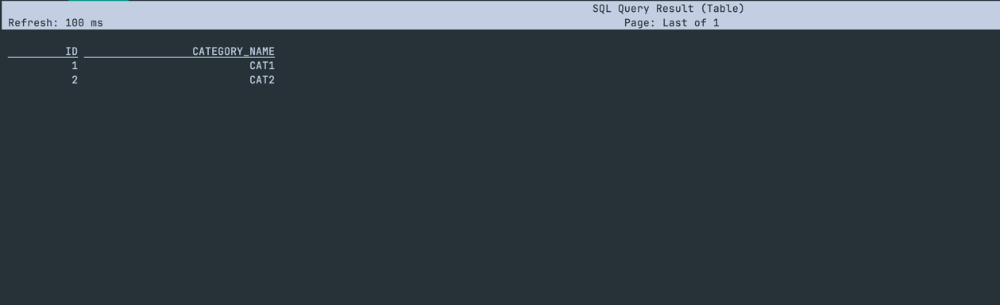
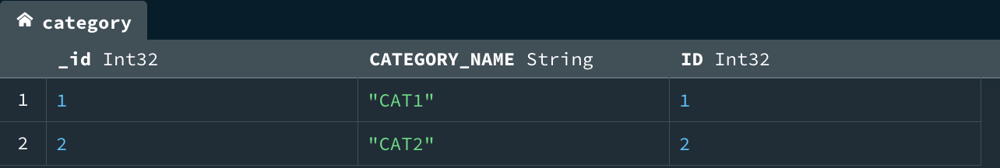
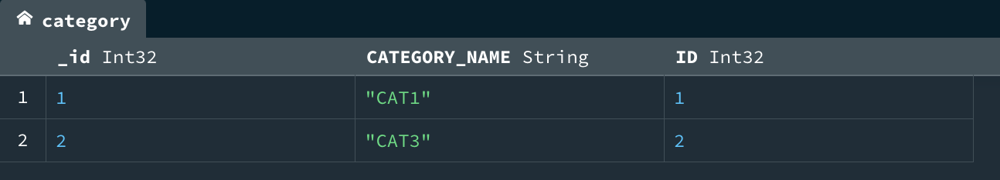

# **Apache Flink CDC** 

The intent of this project is to move data from oracle to mongo and for any data from CDC to flow into mongo db. 

| **Source** 	| **Sink** 	|
|------------	|----------	|
| Oracle     	| MongoDb  	|

`docker-compose.yml` starts the oracledb, mongodb and flink services. 

### Getting Started

1. Run `docker compose up -d`. This brings up oracle db on port 1521, mongo db on 27017 and flink on http://localhost:8081
2. Run oracle insert/update queries using `docker-compose exec oracle sqlplus debezium/dbz@localhost:1521/ORCLCDB`
   1. There is a `category` table under `DEBEZIUM` which can be used.
   2. Data has to loaded into `category` table as well. 
   3. Else create a new table of your choice. 
3. Submit jobs using the sql client in flink by running `docker exec -it jobmanager /opt/flink/bin/sql-client.sh`. This opens up a sql shell where the source and sinks can be configured. 

### Configuring the source
1. Run `docker exec -it jobmanager /opt/flink/bin/sql-client.sh`
2. In the sql shell, if you are continuing with the `category` table,
```sql
    create table category (
      ID INT, 
      CATEGORY_NAME STRING
     ) WITH (
       'connector' = 'oracle-cdc',
       'hostname' = 'host.docker.internal',
       'port' = '1521',
       'username' = 'dbzuser',
       'password' = 'dbz',
       'database-name' = 'ORCLCDB',
       'schema-name' = 'DEBEZIUM',  
       'table-name' = 'category'
     );
```
if you are not on OSX replace `host.docker.internal` with `localhost`.
3. Check if the data is flowing in the stream by,
```sql
select * from category
```


4. This must show up the records which you have inserted earlier. This validates that is source is reachable from the flink cluster. 

### Configuring the sink
1. In the sql shell, if you are continuing with the `category` table, run
```sql
CREATE TABLE mongo_category (
   ID INT,
   CATEGORY_NAME STRING,
   PRIMARY KEY (ID) NOT ENFORCED
 ) WITH (
'connector' = 'mongodb',
  'uri' = 'mongodb://host.docker.internal:27017',
  'database' = 'local',
  'collection' = 'category'
 );
```
3. Test your connectivity using `select * from mongo_category`. 

### Submitting the job
1. Run the sql query `insert into mongo_category select * from category`.
2. This returns the job id which can be monitored on the flink ui under running jobs.
3. Now you should be seeing your data in mongo db under `local` database `cateogry` collection.
4. Output 1

5. Output 2 after an update
